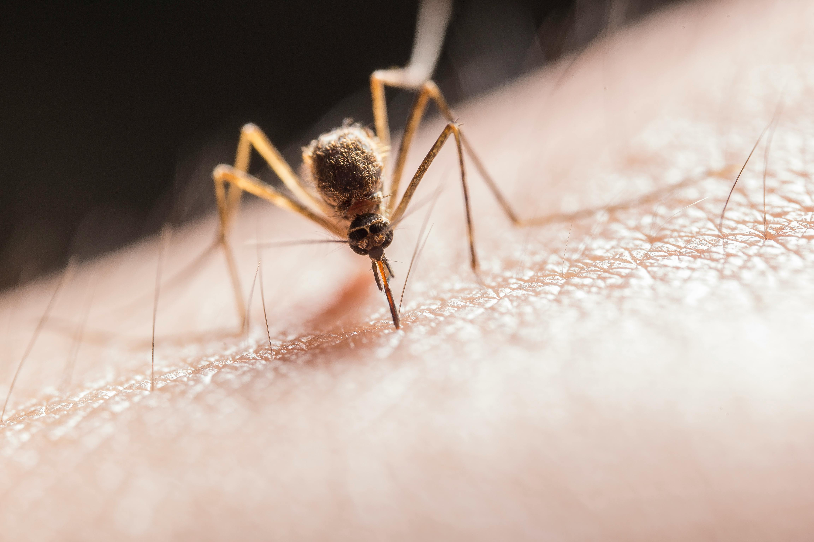
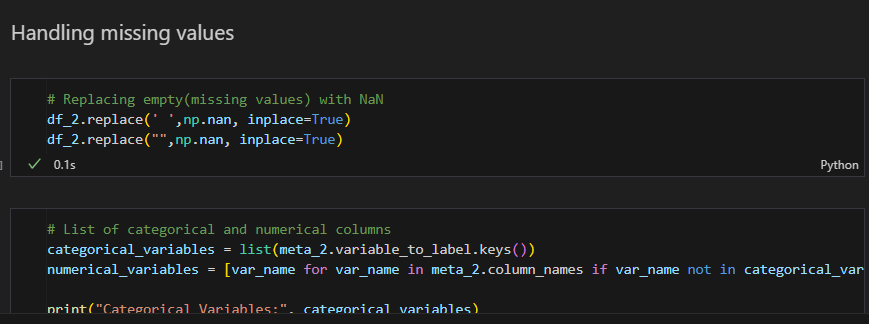
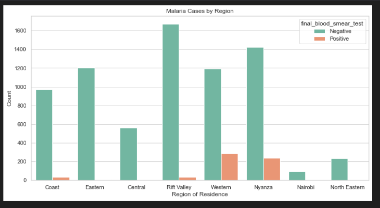
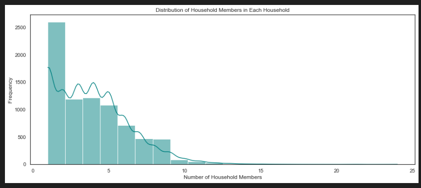
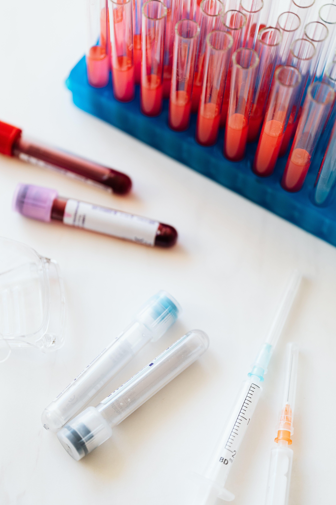

# Phase 5 Group 14 Project

# Leveraging Machine Learning for Enhanced Insights from Kenya Demographic and Health Survey's Malaria Indicator Survey Data.

**Authors**: [Alpha Guya](mailto:alpha.guya@student.moringaschool.com), [Ben Ochoro](mailto:ben.ochoro@student.moringaschool.com), [Caleb Ochieng](mailto:caleb.ochieng@student.moringaschool.com), [Christine Mukiri](mailto:christine.mukiri@student.moringaschool.com), [Dominic Muli](mailto:dominic.muli@student.moringaschool.com), [Frank Mandele](mailto:frank.mandele@student.moringaschool.com), [Jacquiline Tulinye](mailto:jacquiline.tulinye@student.moringaschool.com) and [Lesley Wanjiku](mailto:lesley.wanjiku@student.moringaschool.com).


## 1.0 Introduction


 
Malaria continues to be a significant public health challenge in Kenya, with substantial efforts dedicated to its prevention and control. The Kenya Demographic and Health Survey's Malaria Indicator Survey (KDHS-MIS) provides a rich source of data that, when analyzed using advanced machine learning (ML) techniques, can offer valuable insights and enhance our understanding of malaria prevalence, risk factors, and intervention effectiveness.

## 1.1 Overview of KDHS


The Kenya Demographic and Health Survey (KDHS) is a nationally representative survey conducted in Kenya to gather comprehensive information on population demographics, health, and various related indicators. The KDHS is conducted periodically, typically every five years, and is an essential tool for policymakers, researchers, and organizations involved in public health planning and implementation. The survey aims to provide up-to-date and accurate data on key health and demographic indicators, serving as a foundation for evidence-based decision-making in the health sector.


The KDHS covers a broad range of topics, including fertility, family planning, maternal and child health, nutrition, malaria, HIV/AIDS, and other health-related issues. By employing rigorous sampling techniques, the survey ensures that the collected data is representative of the entire Kenyan population. Through face-to-face interviews and biomarker measurements, the KDHS captures not only self-reported information but also objective health indicators, enhancing the reliability and validity of the findings. This extensive dataset serves as a valuable resource for understanding health trends, identifying challenges, and formulating targeted interventions to improve the overall health and well-being of the Kenyan population.

The survey results are crucial for monitoring progress towards health-related Sustainable Development Goals (SDGs) and informing policies and programs aimed at addressing public health challenges. Researchers and policymakers use KDHS data to analyze trends, identify disparities across regions and population groups, and tailor interventions to specific needs. The KDHS thus plays a pivotal role in shaping the health agenda in Kenya by providing a comprehensive and current snapshot of the health and demographic landscape, facilitating evidence-based decision-making for the benefit of public health initiatives and the overall well-being of the Kenyan population.


## 1.2 Business Problem


The problem at hand revolves around the underexplored potential of leveraging machine learning (ML) techniques for a more in-depth analysis of the Kenya Demographic and Health Survey's Malaria Indicator Survey (KDHS-MIS) data. Despite substantial efforts dedicated to malaria prevention and control in Kenya, the current analytical methods fall short in providing a comprehensive understanding of malaria prevalence, risk factors, and the efficacy of control measures. The lack of systematic application of ML algorithms inhibits the identification of intricate patterns and trends within the KDHS-MIS data, limiting our ability to uncover predictive factors associated with malaria prevalence. Additionally, the absence of predictive models for malaria occurrence, severity, and spatial distribution hampers the formulation of targeted intervention strategies. The problem is further compounded by the limited depth in evaluating the effectiveness of existing control measures, as traditional statistical methods may not capture the nuances that ML models can reveal in terms of accuracy, sensitivity, and specificity.

To address this gap, a structured methodology is proposed, encompassing comprehensive data preprocessing, robust feature selection techniques considering socio-economic, demographic, environmental, and health-related factors, and the development of predictive models using both supervised and unsupervised learning approaches. The proposed research emphasizes the importance of model evaluation, interpretability, and explainability to ensure the practical utility of ML findings for policymakers and public health practitioners. By integrating ML into the analysis of KDHS-MIS data, the research aims to contribute to evidence-based decision-making and enhance the effectiveness of malaria control strategies in Kenya, offering a transformative approach to understanding and combatting malaria in the region. The envisioned outcome is a more nuanced and actionable set of insights derived from ML, enabling targeted interventions and contributing to the broader goal of malaria control and prevention in Kenya.

## 1.3 Objectives

i. Apply machine learning algorithms to analyze KMIS data and identify potential predictive factors associated with malaria prevalence.

ii. To find out the top 5 counties with high malaria cases for enhanced intervention measures.

iii. To develop arobust machine learning model for malaria disease prediction with over 96% accuracy.

## 1.4	Methodology

### a.	Data Preprocessing:

Clean and preprocess the KDHS-MIS dataset to handle missing values, and outliers, and ensure data quality.
Explore the spatial and temporal dimensions of the data to identify patterns in malaria prevalence.

#### Data Cleaning
This involves, the handlig of missing data in the KDHS-MIS dataset and dropping irrelevant columns

#### Data Visualization
Is a powerful tool for exploring, analyzing, and communicating insights from datasets. From the KDHS-MIS, some of the visualization made:



### b.	Feature Selection:

Employ feature selection techniques to identify the most relevant variables influencing malaria prevalence.
Consider socio-economic, demographic, environmental, and health-related factors as potential predictors.

### c.	Model Development:
Utilize supervised learning algorithms (e.g., Random Forest, Gradient Boosting) to build predictive models for malaria prevalence.
Implement unsupervised learning techniques (e.g., clustering) to identify groups with similar malaria risk profiles.

### d.	Model Evaluation:
Assess the performance of the developed models using appropriate metrics such as accuracy, sensitivity, specificity, and area under the ROC curve.
Implement cross-validation to ensure the generalizability of the models.

### e.	Interpretability and Explainability:
Emphasize the interpretability of the developed models to enhance their utility for policymakers and public health practitioners.
Provide insights into the key factors influencing malaria prevalence and their relative importance.

## 1.5	Recommendations:
Derive actionable recommendations for policymakers and healthcare professionals based on the ML findings.
Propose targeted interventions and strategies to reduce malaria prevalence and improve the effectiveness of existing control measures.

## 1.6 	Conclusion:

Summarize the potential impact of leveraging machine learning on enhancing insights from KDHS-MIS data for malaria control and prevention in Kenya.
By integrating machine learning into the analysis of KDHS-MIS data, this proposal aims to contribute to evidence-based decision-making and improve the effectiveness of malaria control strategies in Kenya.

See the full analysis in the [Jupyter Notebook](./KDHS_MIS.ipynb) or review this [presentation](./index.pdf).

For additional info, contact [Alpha Guya](mailto:alpha.guya@student.moringaschool.com), [Ben Ochoro](mailto:ben.ochoro@student.moringaschool.com), [Caleb Ochieng](mailto:caleb.ochieng@student.moringaschool.com), [Christine Mukiri](mailto:christine.mukiri@student.moringaschool.com), [Dominic Muli](mailto:dominic.muli@student.moringaschool.com), [Frank Mandele](mailto:frank.mandele@student.moringaschool.com), [Jacquiline Tulinye](mailto:jacquiline.tulinye@student.moringaschool.com) and [Lesley Wanjiku](mailto:lesley.wanjiku@student.moringaschool.com)

## Repository Structure
```
├── data
├── images
├── index.ipynb
├── index.pdf
├── Recode7_DHS_10Sep2018_DHSG4.pdf
└── README.md
```